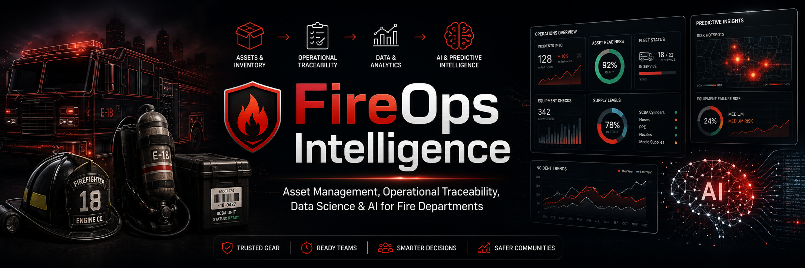

<p align="center">
  
</p>

# FireOps Intelligence

FireOps Intelligence is a learning project for a fire-department inventory API. **Fire Control** is the name shown by its current web demo. The backend uses FastAPI, SQLAlchemy and PostgreSQL; FastAPI also serves a small HTML/CSS/JavaScript interface.

## Current state

| Available now | Not implemented yet |
|---|---|
| `POST /inventory/categories`, `GET /inventory/categories`, `POST /inventory/assets` | Listing assets and getting an asset by ID (Task 06) |
| PostgreSQL migrations for inventory and users; email/password and Google sign-in; authenticated account profile | Authorization for inventory endpoints and invitation-only registration |
| Dashboard demo with connected account pages | Live dashboard metrics, movements, alerts, CSV from real inventory data |

The dashboard's figures are illustrative. Its API indicator and category count read `GET /health` and `GET /inventory/categories`; they do not turn the other widgets into live data. The app bar reads `GET /auth/me` and shows the signed-in user's display name or email, not a sample identity. Registration/sign-in use the backend and set a 30-minute HttpOnly session cookie. Google OAuth runs server-side when configured, with explicit linking for existing password accounts. “Cerrar sesión” requests cookie removal. **Inventory API endpoints are not yet authorization-protected.**

## Quick start with the test database

Prerequisites: Python and PostgreSQL installed, a local `.venv` with dependencies from `requirements.txt`, and a private `.env.test` whose `DATABASE_URL` points to the existing `fireassets_test` database. Apply the committed Alembic migration to that database before using inventory endpoints. The startup scripts do **not** create the database or run migrations.

```bash
# macOS / Linux, from the repository root
./scripts/test-up.sh
```

```powershell
# Windows PowerShell, from the repository root
.\scripts\test-up.ps1
```

These scripts use the Python interpreter in `.venv`, set `ENV_FILE=.env.test` for the server process, reject a database name other than `fireassets_test`, and start Uvicorn at `http://127.0.0.1:8000`. Stop with `Ctrl+C`.

| URL | What it currently serves |
|---|---|
| `/` | Dashboard demo with a valid session; otherwise redirects to sign-in |
| `/iniciar-sesion` | Email/password or Google sign-in |
| `/registro` | Email/password or Google registration |
| `/docs` | Swagger UI for implemented API endpoints |
| `/auth/me` | Current authenticated user's ID, email and optional display name; `401` without a valid session |
| `/health` | `{"status":"ok"}` |

**Important:** `/` requires a valid cookie, but this does not authorize the inventory API. For Google setup, see the [Google OAuth guide](docs/getting-started/google-oauth.md).

For first-time setup, including creation and migration of `fireassets_test`, see [macOS](docs/getting-started/macos.md) or [Windows](docs/getting-started/windows.md). Never commit `.env` or `.env.test`.

## API and data model

| Method and path | Result |
|---|---|
| `POST /inventory/categories` | Create a category; `201` on success |
| `GET /inventory/categories` | List categories ordered by ID; `200`, including `[]` |
| `POST /inventory/assets` | Create an asset linked to an existing category; `201` on success |

The `categorias` table has a unique name. The `bienes` table has a unique internal code and a required foreign key to `categorias.id`. Migration `0374d9a573a1` creates inventory tables; later revisions create users, add Google identity and add optional `display_name`. See [Task 06](labs/TASK_06_GET_ASSET_BY_ID.md) for the **planned**, not yet implemented, read endpoints.

## Repository map

| Path | Purpose |
|---|---|
| `app/main.py` | FastAPI app, routes and static frontend serving |
| `app/modules/inventory/` | Inventory routers, schemas and SQLAlchemy models |
| `app/infrastructure/database/` | Async database engine and session dependency |
| `migrations/` | Alembic schema migration |
| `frontend/` | Vanilla HTML/CSS/JS dashboard demo and connected account pages |
| `scripts/` | Test-database startup and Task 05 test scripts |
| `tests/` | API tests; Task 06 test file is currently empty |
| `labs/` | Current and completed classroom tasks |
| `docs/` | Progress, setup guides and architecture decisions |

Start with the [documentation map](docs/README.md), then see [frontend usage](frontend/README.md), the [ADR index](docs/architecture/adr/README.md) and [project progress](docs/PROGRESS.md). The converted documents under `docs/architecture/history/architecture-history/` are historical proposals, not the current runtime specification.

## Tests and limitations

With `.venv` active and `.env.test` pointing to `fireassets_test`, the Task 05 scripts run Alembic and pytest:

```bash
./scripts/task05_run_tests_mac.sh
```

```powershell
.\scripts\task05_run_tests_windows.ps1
```

These Task 05 scripts use the **current** `python` executable and do not independently verify the database name. Check the active environment and `.env.test` before running them. The frontend/static-route checks can be run separately with `python -m pytest -q tests/test_main_endpoints.py`; from the repository root, `node --test` discovers the dependency-free frontend tests on macOS and Windows.

The account pages authenticate, but the inventory API remains public and dashboard metrics remain illustrative. React + Vite + TypeScript was proposed for a future internal frontend but is **not** the implementation in this repository today.

## Longer-term direction

The project aims to add reliable asset lifecycle tracking, responsibility and location records, movements, audit history and eventually operational analytics. Predictive maintenance or other AI features remain future possibilities, not current capabilities; they depend on trustworthy operational data first.

## License

No license has been selected yet.
