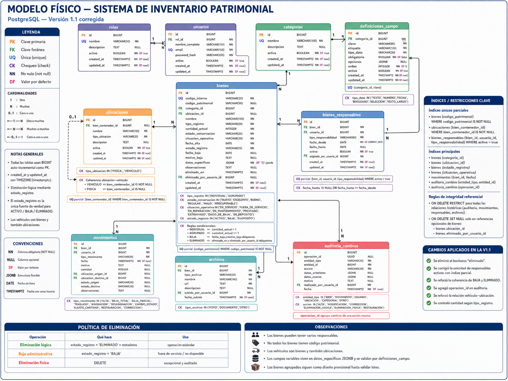

# EXPLICACIÓN DEL MODELO FÍSICO

> Documento histórico convertido desde el archivo Word. Su contenido refleja el análisis original y no necesariamente el estado implementado del proyecto.

**Sistema de Inventario Patrimonial para Bomberos**

*Guía bloque por bloque para una persona que está comenzando a programar*

| **Modelo explicado** | PostgreSQL - versión 1.1 corregida |
| --- | --- |
| **Objetivo** | Comprender qué representa cada tabla y cómo se relaciona |
| **Nivel** | Introducción práctica |
| **Uso previsto** | Base para crear migraciones y programar el backend |

# 1. Cómo leer el diagrama

El modelo físico es el plano concreto de la base de datos. Cada rectángulo representa una tabla de PostgreSQL. Dentro de cada tabla aparecen las columnas, sus tipos de datos y las restricciones que protegen la información.

| **Marca** | **Significado** | **Ejemplo sencillo** |
| --- | --- | --- |
| PK | Clave primaria: identifica una fila de manera única. | roles.id |
| FK | Clave foránea: conecta una tabla con otra. | usuarios.rol_id apunta a roles.id |
| UQ | Valor único: no puede repetirse. | usuarios.email |
| CK | Restricción CHECK: obliga a respetar una regla. | tipo_registro solo puede ser INDIVIDUAL o AGRUPADO |
| NN | NOT NULL: el dato es obligatorio. | bienes.nombre |
| DF | Valor por defecto. | activo empieza en true |

Las líneas entre tablas muestran relaciones. El número 1 indica una sola fila relacionada; N indica muchas. Por ejemplo, una categoría puede tener muchos bienes.

# 2. Vista completa del modelo

*Figura 1. Modelo físico corregido del inventario patrimonial.*

# 3. Tabla roles

**Para qué sirve.** Guarda los tipos generales de usuarios que pueden existir en el sistema.

## Columnas principales

| **Columna** | **Explicación sencilla** |
| --- | --- |
| **id** | Identificador interno del rol. |
| **nombre** | Nombre del rol, por ejemplo ADMINISTRADOR o ENCARGADO_PATRIMONIO. |
| **descripcion** | Explicación de lo que puede hacer ese rol. |
| **activo** | Permite deshabilitar un rol sin borrarlo. |
| **created_at / updated_at** | Fechas automáticas de creación y última modificación. |

**Relación importante.** Un rol puede estar asignado a muchos usuarios. Por eso la relación con usuarios es 1 a N.

**Ejemplo.** Ejemplo: el rol 'ENCARGADO_PATRIMONIO' puede estar asignado a dos personas distintas.

# 4. Tabla usuarios

**Para qué sirve.** Guarda las personas que acceden al sistema o participan en operaciones y responsabilidades.

## Columnas principales

| **Columna** | **Explicación sencilla** |
| --- | --- |
| **id** | Identificador interno del usuario. |
| **rol_id** | Clave foránea que indica qué rol tiene. |
| **nombre_completo** | Nombre visible de la persona. |
| **email** | Correo único usado para identificar la cuenta. |
| **password_hash** | Contraseña transformada de manera segura; nunca se guarda la contraseña original. |
| **activo** | Permite bloquear el acceso sin borrar al usuario. |

**Relación importante.** Muchos usuarios pueden compartir un mismo rol. Un usuario también puede aparecer en auditorías, movimientos, archivos y asignaciones.

**Ejemplo.** Ejemplo: Ana tiene rol ADMINISTRADOR y Juan tiene rol ENCARGADO_PATRIMONIO.

# 5. Tabla categorias

**Para qué sirve.** Clasifica los bienes en grupos sencillos.

## Columnas principales

| **Columna** | **Explicación sencilla** |
| --- | --- |
| **id** | Identificador de la categoría. |
| **nombre** | Nombre único, como VEHICULO, CASCO, COMPUTADORA o MOBILIARIO. |
| **descripcion** | Texto opcional que explica qué entra en la categoría. |
| **activa** | Permite dejar de usar una categoría sin borrar los bienes existentes. |

**Relación importante.** Una categoría puede tener muchos bienes y muchas definiciones de campo. En esta versión no hay subcategorías.

**Ejemplo.** Ejemplo: la categoría CASCO puede definir los campos marca, modelo, talle y fecha de vencimiento.

# 6. Tabla definiciones_campo

**Para qué sirve.** Describe los campos dinámicos que tendrá cada categoría.

## Columnas principales

| **Columna** | **Explicación sencilla** |
| --- | --- |
| **categoria_id** | Indica a qué categoría pertenece el campo. |
| **clave** | Nombre técnico estable, por ejemplo fecha_vencimiento. |
| **etiqueta** | Texto que verá el usuario, por ejemplo Fecha de vencimiento. |
| **tipo_dato** | Define si el valor es texto, número, fecha, booleano, selección o texto largo. |
| **obligatorio** | Indica si el usuario debe completar el campo. |
| **opciones** | Lista JSONB usada cuando el tipo es selección. |
| **orden** | Posición del campo dentro del formulario. |
| **activa** | Permite ocultar el campo sin destruir datos anteriores. |

**Relación importante.** La combinación categoria_id + clave debe ser única. Así no existen dos campos marca dentro de la misma categoría.

**Ejemplo.** Esta tabla permite que Bomberos agregue campos desde un panel sin pedir una migración al programador.

# 7. Tabla bienes

**Para qué sirve.** Es la tabla central. Guarda el estado actual de cada elemento patrimonial.

## Columnas principales

| **Columna** | **Explicación sencilla** |
| --- | --- |
| **codigo_interno** | Código obligatorio y único creado por el sistema. |
| **codigo_patrimonial** | Código oficial opcional; no todos los bienes lo tienen. |
| **categoria_id** | Categoría a la que pertenece el bien. |
| **ubicacion_id** | Ubicación actual; puede ser nula. |
| **nombre** | Nombre o descripción corta del bien. |
| **tipo_registro** | INDIVIDUAL o AGRUPADO. |
| **cantidad_actual** | Cantidad disponible. Si es individual debe ser 1. |
| **estado_conservacion** | NUEVO, EXCELENTE, BUENO, REGULAR, MALO o IRRECUPERABLE. |
| **situacion_operativa** | Indica si está en servicio, reparación, mantenimiento, prestado, etc. |
| **fecha_alta** | Fecha administrativa de incorporación. |
| **estado_registro** | ACTIVO, BAJA o ELIMINADO. |
| **fecha_baja / motivo_baja** | Datos exigidos cuando el bien pasa a BAJA. |
| **datos_especificos** | JSONB con los campos variables definidos por la categoría. |
| **observaciones** | Texto libre adicional. |
| **eliminado_en / eliminado_por_usuario_id** | Quién y cuándo realizó una eliminación lógica. |

**Relación importante.** La tabla bienes representa el estado presente. El historial se conserva aparte en movimientos y auditoria_cambios.

**Ejemplo.** Ejemplo: un tubo de aire puede estar en estado BUENO, situación EN_SERVICIO, ubicado en Autobomba 2 y tener datos específicos de presión y capacidad.

# 8. Tabla ubicaciones

**Para qué sirve.** Representa lugares donde puede encontrarse un bien.

## Columnas principales

| **Columna** | **Explicación sencilla** |
| --- | --- |
| **bien_contenedor_id** | Cuando la ubicación es un vehículo, apunta al bien que representa ese vehículo. |
| **nombre** | Nombre de la ubicación, como Depósito principal o Autobomba 2. |
| **tipo_ubicacion** | FISICA o VEHICULO. |
| **descripcion** | Aclaración opcional. |
| **activa** | Permite dejar de usar una ubicación sin borrar el historial. |

**Relación importante.** Una ubicación puede contener muchos bienes. Un vehículo se registra como bien y también como ubicación vinculada.

**Ejemplo.** Ejemplo: Autobomba 2 es un bien; además existe una ubicación Autobomba 2 donde se guardan tubos, herramientas y mangueras.

# 9. Tabla bienes_responsables

**Para qué sirve.** Une bienes con usuarios responsables y permite varios responsables por bien.

## Columnas principales

| **Columna** | **Explicación sencilla** |
| --- | --- |
| **bien_id** | Bien asignado. |
| **usuario_id** | Usuario responsable. |
| **tipo_responsabilidad** | Clase de responsabilidad: operativa, mantenimiento, patrimonial, etc. |
| **fecha_desde / fecha_hasta** | Período de responsabilidad. |
| **activo** | Indica si la asignación sigue vigente. |
| **asignado_por_usuario_id** | Usuario que creó la asignación. |

**Relación importante.** Esta es una entidad asociativa: resuelve una relación muchos a muchos y además guarda datos propios de la relación.

**Ejemplo.** El índice único parcial evita dos asignaciones activas iguales, pero permite conservar varios períodos históricos.

# 10. Tabla movimientos

**Para qué sirve.** Guarda hechos operativos que afectan un bien.

## Columnas principales

| **Columna** | **Explicación sencilla** |
| --- | --- |
| **bien_id** | Bien afectado. |
| **usuario_id** | Persona que realizó el movimiento. |
| **tipo_movimiento** | ALTA, BAJA_TOTAL, BAJA_PARCIAL, TRASLADO, ASIGNACION, etc. |
| **fecha** | Momento exacto de la operación. |
| **motivo** | Razón del movimiento. |
| **cantidad** | Se usa en movimientos de bienes agrupados. |
| **ubicacion_origen_id / ubicacion_destino_id** | Ubicaciones antes y después de un traslado. |
| **estado_origen / estado_destino** | Estados antes y después de un cambio. |
| **observaciones** | Detalle adicional. |

**Relación importante.** Un bien puede tener muchos movimientos. Estos movimientos permiten reconstruir su historia operativa.

**Ejemplo.** Ejemplo: un motor portátil fue trasladado del Depósito principal a Autobomba 1 el 30/07/2026.

# 11. Tabla archivos

**Para qué sirve.** Relaciona fotografías y documentos con un bien.

## Columnas principales

| **Columna** | **Explicación sencilla** |
| --- | --- |
| **bien_id** | Bien al que pertenece el archivo. |
| **tipo_archivo** | FOTO, DOCUMENTO u OTRO. |
| **nombre** | Nombre visible del archivo. |
| **url** | Dirección donde está almacenado. |
| **descripcion** | Explicación opcional. |
| **subido_por_usuario_id** | Usuario que lo cargó. |
| **fecha_subida** | Momento de carga. |

**Relación importante.** La base no guarda necesariamente el archivo pesado; guarda su referencia y metadatos.

**Ejemplo.** Ejemplo: fotografía frontal de un casco, factura de compra o certificado de mantenimiento.

# 12. Tabla auditoria_cambios

**Para qué sirve.** Registra quién cambió información y qué cambió.

## Columnas principales

| **Columna** | **Explicación sencilla** |
| --- | --- |
| **operacion_id** | Agrupa varios cambios pertenecientes a una misma acción masiva. |
| **entidad_tipo** | Tipo de objeto afectado: BIEN, MOVIMIENTO, USUARIO, UBICACION, etc. |
| **entidad_id** | Identificador del objeto afectado. |
| **accion** | ALTA, MODIFICACION, CORRECCION, ELIMINACION_LOGICA, RESTAURACION, etc. |
| **datos_anteriores** | Copia JSONB de los valores antes del cambio. |
| **datos_nuevos** | Copia JSONB de los valores posteriores. |
| **motivo** | Razón escrita por el usuario. |
| **realizado_por_usuario_id** | Persona que efectuó el cambio. |
| **fecha** | Momento exacto. |

**Relación importante.** La auditoría no reemplaza a movimientos. Movimientos registra hechos del patrimonio; auditoría registra modificaciones del sistema.

**Ejemplo.** Ejemplo: un usuario corrigió el estado de BUENO a REGULAR porque se había cargado mal.

# 13. Índices: para qué sirven

Un índice funciona como el índice de un libro: ayuda a encontrar datos sin revisar todas las filas. No cambia el contenido; mejora la velocidad de búsquedas frecuentes.

- Índice por categoria_id: acelera la lista de bienes de una categoría.

- Índice por ubicacion_id: acelera la consulta de elementos dentro de una ubicación.

- Índice por estado_registro: acelera filtros de activos, bajas o eliminados.

- Índice único parcial de codigo_patrimonial: evita duplicados solo cuando el código existe.

- Índice de auditoría por operacion_id: permite revisar una acción masiva completa.

Crear demasiados índices también tiene un costo porque cada escritura debe actualizarlos. Por eso se agregan principalmente en columnas usadas para búsquedas, filtros o relaciones.

# 14. Restricciones: por qué están en la base

Las restricciones protegen los datos incluso si el frontend o el backend cometen un error. Son una segunda línea de defensa.

| **Regla** | **Protección que aporta** |
| --- | --- |
| Bien individual | La base exige cantidad_actual = 1. |
| Baja administrativa | Exige fecha_baja y motivo_baja. |
| Eliminación lógica | Exige eliminado_en y eliminado_por_usuario_id. |
| Ubicación vehicular | Exige bien_contenedor_id. |
| Responsable activo | Impide duplicar la misma asignación activa. |

# 15. Política de baja y eliminación

En el sistema existen tres acciones diferentes:

| **Acción** | **Qué ocurre** | **Uso recomendado** |
| --- | --- | --- |
| Baja administrativa | El bien sigue existiendo, pero estado_registro pasa a BAJA. | Bien fuera de servicio o no disponible. |
| Eliminación lógica | estado_registro pasa a ELIMINADO y se guardan usuario y fecha. | Operación normal para ocultar registros. |
| Eliminación física | Se ejecuta DELETE y la fila desaparece. | Solo casos excepcionales, autorizados y auditados. |

# 16. Cómo se transforma una consulta en un objeto para el frontend

PostgreSQL guarda la información separada en tablas. El repositorio consulta esas tablas y arma una estructura estable para que los servicios y el frontend no tengan que conocer detalles internos de la base de datos.

| PostgreSQL  
   ↓  
SQL directo / query builder / ORM  
   ↓  
Repositorio  
   ↓  
Objeto BienDetalle  
   ↓  
Servicio y controlador  
   ↓  
Frontend |
| --- |

De esta forma se puede usar Prisma para una operación, Kysely para otra y SQL directo para un reporte, siempre que el repositorio entregue el mismo contrato.

# 17. Ejemplo completo: registrar un casco

**1.** El usuario elige la categoría CASCO.

**2.** El backend consulta definiciones_campo y descubre que debe pedir marca, modelo, talle y fecha de vencimiento.

**3.** Se crea una fila en bienes con los datos generales.

**4.** Los atributos especiales se guardan en datos_especificos JSONB.

**5.** Se crea un movimiento de tipo ALTA.

**6.** Si se asignan responsables, se crean filas en bienes_responsables.

**7.** Si se cargan fotos, se crean filas en archivos.

**8.** La operación queda registrada en auditoria_cambios.

| datos_especificos = {  
  "marca": "MSA",  
  "modelo": "F1XF",  
  "talle": "M",  
  "fecha_vencimiento": "2030-04-15"  
} |
| --- |

# 18. Qué todavía debe validarse con Bomberos

- Cómo se agrupan bienes como sillas, prendas o herramientas equivalentes.

- Qué tipos de responsabilidad usarán realmente.

- Qué tipos de movimiento necesitan además de los propuestos.

- Qué datos deben ser obligatorios en cada categoría.

- Quién puede realizar bajas, eliminaciones, correcciones y restauraciones.

- Qué documentos deben conservarse por cada tipo de bien.

# 19. Conclusión

El modelo físico organiza el inventario alrededor de una tabla central de bienes, acompañada por tablas especializadas para categorías, ubicaciones, responsables, movimientos, archivos y auditoría. PostgreSQL mantiene la coherencia mediante claves foráneas, restricciones e índices, mientras JSONB permite registrar atributos distintos sin crear columnas nuevas para cada categoría.

Con esta estructura ya es posible comenzar a escribir migraciones y pruebas de integridad. Antes de construir todo el backend, conviene realizar una carga piloto con ejemplos reales para confirmar especialmente el tratamiento de bienes agrupados.
