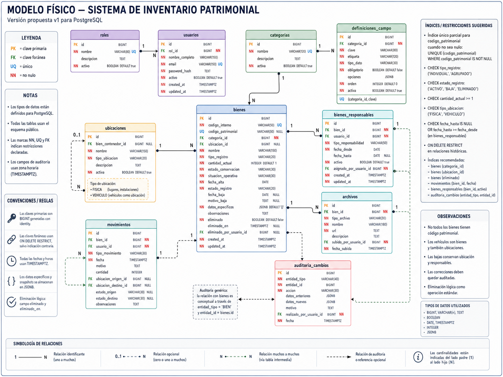

# DECISIÓN ARQUITECTÓNICA

> Documento histórico convertido desde el archivo Word. Su contenido refleja el análisis original y no necesariamente el estado implementado del proyecto.

**Sistema de Inventario Patrimonial para Bomberos**

*Versión de diseño alcanzada durante el estudio del Capítulo 3*  
*de Designing Data-Intensive Applications, 2.ª edición*

| **Estado** | Propuesta arquitectónica inicial |
| --- | --- |
| **Alcance** | Modelado de datos y persistencia del MVP |
| **Base de datos objetivo** | PostgreSQL |
| **Documento** | ADR preliminar — sujeto a validación con la unidad de Bomberos |

# 1. Resumen ejecutivo

**Decisión principal.** El sistema se implementará con un modelo híbrido: relacional para las entidades, relaciones, trazabilidad y datos que requieren integridad; y documental mediante JSONB para los atributos variables de cada categoría.

**Motivo.** El inventario combina datos estables —bienes, usuarios, ubicaciones, responsables, movimientos y archivos— con atributos que cambian según el tipo de elemento, por ejemplo talle, presión, número de motor, capacidad o fecha de vencimiento.

**Criterio rector.** La flexibilidad no debe eliminar la integridad. Los campos variables podrán configurarse sin modificar el esquema físico cada vez, pero serán definidos y validados mediante reglas almacenadas en la tabla definiciones_campo.

# 2. Contexto del problema

La unidad de Bomberos necesita digitalizar las altas, bajas, estado de conservación, ubicación, responsables, documentos y detalles particulares de todo su patrimonio. Al momento del relevamiento inicial no existe una lista cerrada de elementos ni de atributos específicos.

Entre los bienes observados se encuentran cascos, chaquetas, pantalones, tubos de aire, motores portátiles, camiones, camionetas, televisores, heladeras, cámaras, computadoras, mesas y sillas. Esta diversidad impide diseñar una única tabla rígida con todas las columnas posibles sin producir una estructura difícil de mantener.

# 3. Fundamento

los modelos de datos condicionan la forma de representar, consultar y evolucionar la información. Para este proyecto se tomaron especialmente las comparaciones entre el modelo relacional y el documental, las relaciones muchos-a-uno y muchos-a-muchos, y los efectos de la normalización y la desnormalización.

La decisión no consiste en elegir un único modelo para todo el sistema. Se combinan ambos en función del tipo de información: relaciones compartidas y consistentes en tablas; atributos variables y específicos en un documento JSONB controlado.

# 4. Declaración de la decisión arquitectónica

| Se adoptará PostgreSQL como sistema de registro principal. Los datos estables y relacionados se almacenarán en tablas normalizadas. Los atributos particulares de cada categoría se almacenarán en una columna JSONB, cuya estructura será definida y validada por metadatos configurables. |
| --- |

# 5. Reglas de negocio confirmadas

| **Regla** | **Definición** |
| --- | --- |
| **Responsabilidad múltiple** | Un bien puede tener varios responsables simultáneos o históricos. |
| **Código patrimonial opcional** | No todos los bienes poseen código patrimonial oficial. |
| **Código interno obligatorio** | Todo bien tendrá un identificador interno único generado por el sistema. |
| **Vehículos como ubicaciones** | Un vehículo es un bien patrimonial y, al mismo tiempo, puede contener otros bienes. |
| **Categorías simples en el MVP** | Por el momento no se implementarán subcategorías. |
| **Baja con conservación de contexto** | Una baja conserva la última ubicación, responsables, archivos e historial. |
| **Correcciones auditadas** | Todo dato puede corregirse, pero debe registrarse quién corrigió, cuándo, qué cambió y por qué. |
| **Eliminación** | Puede eliminarse uno o varios bienes; la operación estándar será lógica y la eliminación física será excepcional. |
| **Bienes agrupados** | La estrategia definitiva de agrupación queda pendiente de validación mediante casos reales. |

# 6. Componentes del modelo de datos

- **roles**: Catálogo de roles habilitados para los usuarios.

- **usuarios**: Personas que acceden al sistema, realizan cambios, cargan archivos o asumen responsabilidades.

- **categorias**: Clasificación simple de los bienes, sin jerarquías en la primera versión.

- **definiciones_campo**: Metadatos de los campos dinámicos permitidos para cada categoría.

- **ubicaciones**: Lugares físicos o vehículos que pueden contener bienes.

- **bienes**: Registro principal del patrimonio y estado actual de cada bien.

- **bienes_responsables**: Tabla intermedia que implementa la relación muchos-a-muchos entre bienes y usuarios.

- **movimientos**: Historial operativo: altas, bajas, traslados, cambios de estado y ajustes de cantidad.

- **archivos**: Fotografías, actas, facturas, manuales, certificados u otros documentos asociados.

- **auditoria_cambios**: Registro transversal de modificaciones, correcciones, eliminaciones y restauraciones.

# 7. Distribución entre modelo relacional y documental

| **Información** | **Representación** | **Justificación** |
| --- | --- | --- |
| Categorías, usuarios, ubicaciones | Tablas relacionales | Son entidades compartidas y referenciadas por múltiples registros. |
| Responsables | Tabla intermedia | Un bien puede tener varios responsables y un usuario puede responder por varios bienes. |
| Movimientos y auditoría | Tablas relacionales | Requieren trazabilidad, fecha, autor y relaciones consistentes. |
| Atributos particulares | JSONB | Varían según la categoría y no justifican alterar el esquema por cada nuevo campo. |
| Definición de atributos | Tabla relacional | Permite validar claves, tipos, obligatoriedad, opciones y orden. |

# 8. Política para campos dinámicos

Los usuarios autorizados no crearán columnas físicas en PostgreSQL. Desde la interfaz crearán definiciones de campo comparables a las preguntas de un formulario.

- Cada definición deberá incluir, como mínimo:

  - categoría a la que pertenece;

  - clave técnica única dentro de esa categoría;

  - etiqueta visible;

  - tipo de dato;

  - obligatoriedad;

  - opciones válidas cuando corresponda;

  - orden de presentación;

  - estado activo o inactivo.

El backend validará datos_especificos antes de persistirlo. No se aceptarán claves desconocidas, valores de tipo incorrecto ni omisiones de campos obligatorios.

# 9. Integridad y trazabilidad

- codigo_interno será obligatorio y único.

- codigo_patrimonial será opcional y único solamente cuando tenga valor.

- Las relaciones históricas usarán restricciones que eviten borrados accidentales.

- La baja de un bien no elimina su ficha ni sus relaciones.

- La eliminación común será lógica y podrá restaurarse.

- Las correcciones sensibles requerirán motivo.

- La auditoría conservará el estado anterior y el nuevo en JSONB.

- Los movimientos identificarán al usuario que realizó la operación.

# 10. Vehículos que también funcionan como ubicaciones

Los vehículos se registrarán como bienes. Cuando un vehículo pueda contener equipamiento, también tendrá una fila vinculada en ubicaciones mediante bien_contenedor_id.

Esta solución evita duplicar manualmente sus datos y permite consultar, por ejemplo, qué tubos, herramientas o equipos se encuentran dentro de una autobomba.

Regla de integridad: un vehículo no podrá tenerse a sí mismo como ubicación ni formar ciclos de contención.

# 11. Decisión pendiente: bienes agrupados

Aún no está definida la forma final de representar conjuntos como sillas, prendas o herramientas equivalentes. Para la primera implementación se propone admitir:

- INDIVIDUAL: cantidad igual a 1;

- AGRUPADO: cantidad_actual mayor o igual a 1;

- movimientos de entrada, salida, baja parcial o ajuste de cantidad.

Esta solución deberá probarse con situaciones reales. Si diferentes unidades del mismo grupo terminan con estados, ubicaciones o responsables distintos, será necesario incorporar lotes o dividir el registro agrupado.

# 12. Consecuencias de la decisión

## 12.1 Beneficios

- Permite incorporar nuevas categorías y atributos sin migraciones constantes.

- Mantiene relaciones fuertes y consultas confiables para los datos centrales.

- Conserva trazabilidad administrativa.

- Reduce la dependencia permanente de un programador para agregar campos.

- Permite comenzar con una arquitectura simple y evolucionarla después.

## 12.2 Costos y riesgos

- El JSONB requiere validación estricta en el backend.

- Los reportes sobre campos dinámicos pueden necesitar consultas e índices específicos.

- Cambiar el tipo de un campo exige una estrategia de migración de valores antiguos.

- La auditoría genérica debe diseñarse cuidadosamente para que sea fácil de consultar.

- La agrupación de bienes aún necesita validación operativa.

# 13. Alcance para comenzar a codificar

Con esta decisión ya puede iniciarse la implementación del esquema PostgreSQL y de las migraciones iniciales. No obstante, antes de construir todo el backend conviene validar el modelo con una carga piloto.

- un vehículo que también funcione como ubicación;

- un casco individual con varios responsables;

- un tubo de aire con atributos específicos;

- una computadora con código patrimonial;

- un bien sin código patrimonial;

- un conjunto de sillas agrupadas;

- una baja que conserve ubicación y responsables;

- una corrección auditada;

- una eliminación masiva lógica y su restauración.

# 14. Modelo físico propuesto

*Figura 1. Modelo físico propuesto para PostgreSQL.*

# 15. Fuente de estudio

Kleppmann, Martin; Riccomini, Chris. Designing Data-Intensive Applications: The Big Ideas Behind Reliable, Scalable, and Maintainable Systems. 2.ª edición, O’Reilly Media, 2026. Capítulo 3: Data Models and Query Languages.

Nota: el libro fundamenta la comparación entre modelos relacionales y documentales, normalización, relaciones y compromisos de diseño. La división formal en modelo conceptual, lógico y físico, así como las tablas concretas de este documento, constituyen una aplicación de ingeniería realizada para el dominio del inventario de Bomberos.

# 16. Matriz de decisiones y fundamentos

La siguiente matriz resume qué decisión se tomó, por qué se tomó, qué alternativa se descartó y qué consecuencia práctica produce en la implementación.

| **Decisión** | **Por qué se tomó** | **Alternativa descartada** | **Consecuencia** |
| --- | --- | --- | --- |
| **PostgreSQL como sistema de registro principal** | El inventario requiere relaciones, restricciones, transacciones, consultas y trazabilidad confiable. | Usar solamente documentos o archivos JSON como fuente oficial. | La base relacional concentra la versión autoritativa del patrimonio y reduce inconsistencias. |
| **Modelo híbrido: relacional + JSONB** | Los datos centrales son estables y compartidos, pero los atributos particulares varían según la categoría. | Crear una columna física por cada nuevo atributo o guardar todo como JSON. | Se conserva integridad en lo estable y flexibilidad en lo variable. |
| **Campos dinámicos definidos en definiciones_campo** | Bomberos todavía no conoce todos los atributos que necesitará y no debe depender de un programador para cada campo nuevo. | Ejecutar ALTER TABLE cada vez que aparezca un dato nuevo. | El usuario autorizado configura formularios sin modificar el esquema físico. |
| **Bien con código interno obligatorio y código patrimonial opcional** | No todos los elementos poseen código patrimonial, pero el sistema necesita identificar cada registro sin ambigüedad. | Usar el código patrimonial como clave primaria o hacerlo obligatorio. | Todos los bienes son identificables aunque no tengan numeración oficial. |
| **Relación muchos-a-muchos entre bienes y responsables** | Un bien puede tener varios responsables y un usuario puede responder por varios bienes. | Guardar un único responsable_usuario_id dentro de bienes. | Se admiten responsabilidades simultáneas e históricas sin duplicar bienes. |
| **Vehículos modelados como bienes y también como ubicaciones** | Los vehículos forman parte del patrimonio y al mismo tiempo transportan equipamiento. | Duplicar el vehículo sin relación o tratarlo solamente como ubicación. | Puede consultarse la ficha del vehículo y qué elementos contiene. |
| **Sin subcategorías en el MVP** | La clasificación todavía no está definida y agregar jerarquías ahora aumentaría complejidad sin evidencia de necesidad. | Crear desde el inicio una jerarquía ilimitada de categorías. | El modelo inicial es más simple y puede ampliarse mediante una migración futura. |
| **Baja administrativa sin borrar ubicación ni responsables** | Una baja forma parte de la historia del patrimonio; el contexto del bien sigue siendo relevante. | Desvincular relaciones o eliminar la fila al dar de baja. | Se preserva la última situación conocida y la trazabilidad. |
| **Correcciones permitidas con auditoría obligatoria** | Los errores humanos son inevitables, pero un sistema patrimonial debe explicar qué cambió, quién lo hizo y por qué. | Prohibir toda corrección o sobrescribir datos sin historial. | El dato puede corregirse sin perder evidencia del estado anterior. |
| **Eliminación lógica como operación estándar** | El usuario pidió eliminar uno o varios bienes, pero el borrado físico puede destruir información administrativa. | Ejecutar DELETE definitivo desde la operación común. | Los bienes se ocultan del inventario normal, quedan auditados y pueden restaurarse. |
| **Tabla de movimientos separada del estado actual** | La ficha del bien debe responder rápido por su estado actual, mientras el historial debe conservar altas, bajas, traslados y ajustes. | Guardar solo el último estado o reconstruir siempre todo desde eventos. | Se obtiene lectura simple del estado actual y trazabilidad histórica. |
| **Bienes agrupados como decisión provisional** | No existe todavía información suficiente para definir lotes, series o particiones por estado y ubicación. | Diseñar prematuramente una estructura compleja de lotes. | La V1 usa tipo_registro y cantidad_actual; el modelo se revisará con una carga piloto. |

# 17. Conclusión de arquitectura

**Conclusión.** La arquitectura adoptada prioriza integridad, trazabilidad y capacidad de evolución. PostgreSQL actúa como fuente oficial; las relaciones críticas permanecen normalizadas; los atributos particulares se guardan en JSONB bajo un esquema configurable; y toda corrección, baja o eliminación queda registrada.

La decision: no se eligió un modelo relacional o documental de forma absoluta, sino que cada uno se aplicó donde ofrece mejor equilibrio entre consistencia, flexibilidad y facilidad de consulta.
