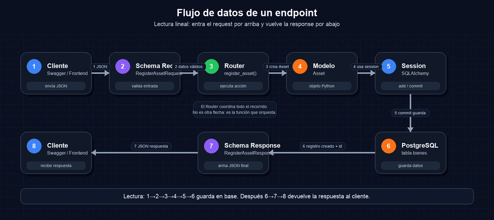

# Task 03 — Registrar un bien usando la base de datos

En esta tarea vamos a crear el endpoint `POST /inventory/assets` para guardar un bien real en PostgreSQL.

> Esta tarea depende de que la **Task 02** ya esté terminada: deben existir las tablas `categorias` y `bienes` en PostgreSQL.

## Qué vamos a construir

Vamos a crear el primer endpoint real del módulo de inventario:

```text
POST /inventory/assets
```

Este endpoint va a recibir un JSON, validarlo, crear un bien y guardarlo en la tabla `bienes`.

## Importante: este endpoint es una primera versión

El modelo completo del sistema después tendrá más cosas:

```text
ubicaciones
responsables
movimientos
archivos
auditoría
campos configurables por categoría
```

Pero ahora vamos despacio. En esta tarea sólo vamos a registrar un bien con estos datos mínimos:

```text
codigo_interno
nombre
categoria_id
```

La idea es aprender bien el flujo completo antes de agregar más complejidad.

---

## Objetivo

Crear o modificar:

```text
app/modules/inventory/register_asset/schemas.py
app/modules/inventory/register_asset/router.py
app/main.py
```

## Mapa de archivos y orden de implementación

Esta tarea se escribe en tres lugares distintos. No copies todo en un solo archivo. Cada pieza tiene una responsabilidad.

| Orden | Archivo | Qué se escribe ahí | Por qué va ahí |
|---|---|---|---|
| 1 | `app/modules/inventory/register_asset/schemas.py` | Clases `RegisterAssetRequest` y `RegisterAssetResponse` | Define la forma de los datos que entran y salen del endpoint |
| 2 | `app/modules/inventory/register_asset/router.py` | Función `register_asset` y router `POST /inventory/assets` | Define la ruta HTTP y la lógica mínima para guardar el bien |
| 3 | `app/main.py` | `app.include_router(register_asset_router)` | Conecta el router nuevo con la aplicación principal |

El orden importa:

```text
primero schemas.py
  ↓
después router.py
  ↓
después main.py
  ↓
recién ahí probar en /docs
```

Si intentás crear el router antes de los schemas, Python no va a encontrar `RegisterAssetRequest` ni `RegisterAssetResponse`.

Si olvidás conectar el router en `main.py`, el endpoint no va a aparecer en `/docs`.

---

## Diagrama simple del flujo de datos de un endpoint

Este diagrama sirve para entender cualquier endpoint que creemos en el proyecto.



## Lectura guiada del diagrama

Leé la imagen de izquierda a derecha y después bajá hacia la base de datos. Este flujo muestra qué ocurre desde que alguien envía datos hasta que PostgreSQL los guarda y la API responde.

```text
Cliente / navegador / Swagger docs
        │
        │ envía JSON
        ▼
Schema de entrada
RegisterAssetRequest
        │
        │ valida los datos
        ▼
Router / endpoint
register_asset()
        │
        │ ejecuta la acción solicitada
        ▼
Modelo de base de datos
Asset
        │
        │ se agrega a la sesión
        ▼
SQLAlchemy Session
session.add()
session.commit()
session.refresh()
        │
        │ guarda en PostgreSQL
        ▼
Tabla bienes
PostgreSQL
        │
        │ devuelve el registro creado
        ▼
Schema de salida
RegisterAssetResponse
        │
        │ responde JSON
        ▼
Cliente / navegador / Swagger docs
```

## Cómo leer este flujo

| Parte | Qué significa | En qué archivo suele estar |
|---|---|---|
| Cliente | Quien llama al endpoint | Navegador, Swagger docs, frontend o test |
| Schema de entrada | Define qué datos se aceptan | `schemas.py` |
| Router / endpoint | Define la URL y la función que se ejecuta | `router.py` |
| Modelo | Representa la tabla de la base de datos | `models.py` |
| Session | Es el puente entre Python y PostgreSQL | `app/infrastructure/database/session.py` |
| Tabla | Lugar donde quedan guardados los datos | PostgreSQL |
| Schema de salida | Define qué JSON se responde | `schemas.py` |

La idea importante es esta:

```text
El endpoint no es sólo una función.
Es un recorrido completo desde un JSON de entrada hasta un JSON de respuesta.
```

---

# Paso 0 — Crear archivos `__init__.py` vacíos

Antes de crear `schemas.py` y `router.py`, vamos a preparar las carpetas para que Python las pueda importar de forma clara.

## Qué archivos crear

Verificá o creá estos archivos vacíos:

```text
app/modules/__init__.py
app/modules/inventory/__init__.py
app/modules/inventory/register_asset/__init__.py
app/modules/inventory/shared/__init__.py
```

Si también existe la carpeta `get_asset`, creá este archivo:

```text
app/modules/inventory/get_asset/__init__.py
```

## Cómo crearlos según tu sistema operativo

Usá sólo los comandos que corresponden a tu computadora.

**Windows / PowerShell**

Desde PowerShell, parado en la raíz del proyecto:

```powershell
New-Item -ItemType Directory -Force app/modules/inventory/register_asset
New-Item -ItemType Directory -Force app/modules/inventory/shared
New-Item -ItemType Directory -Force app/modules/inventory/get_asset

New-Item -ItemType File -Force app/modules/__init__.py
New-Item -ItemType File -Force app/modules/inventory/__init__.py
New-Item -ItemType File -Force app/modules/inventory/register_asset/__init__.py
New-Item -ItemType File -Force app/modules/inventory/shared/__init__.py
New-Item -ItemType File -Force app/modules/inventory/get_asset/__init__.py
```

**macOS o Linux / Terminal**

Desde la terminal, parado en la raíz del proyecto:

```bash
mkdir -p app/modules/inventory/register_asset
mkdir -p app/modules/inventory/shared
mkdir -p app/modules/inventory/get_asset

touch app/modules/__init__.py
touch app/modules/inventory/__init__.py
touch app/modules/inventory/register_asset/__init__.py
touch app/modules/inventory/shared/__init__.py
touch app/modules/inventory/get_asset/__init__.py
```

En macOS o Linux, `touch` crea el archivo si no existe. Si el archivo ya existe, no rompe nada.

## Qué contenido llevan

Por ahora pueden quedar vacíos.

```python
# Este archivo puede quedar vacío.
# Le indica a Python que esta carpeta forma parte de un paquete importable.
```

## Para qué sirve `__init__.py`

Un archivo `__init__.py` sirve para marcar una carpeta como parte de un paquete Python.

Un paquete es una carpeta desde donde Python puede importar código.

Por ejemplo, si queremos hacer este import:

```python
from app.modules.inventory.register_asset.router import router as register_asset_router
```

Python tiene que poder recorrer este camino:

```text
app
  ↓
modules
  ↓
inventory
  ↓
register_asset
  ↓
router.py
```

Regla simple para este proyecto:

```text
Si una carpeta contiene código Python que vamos a importar, esa carpeta debe tener __init__.py.
```

---

# Paso 1 — Crear schemas

Crear:

```text
app/modules/inventory/register_asset/schemas.py
```

Copiar:

```python
# Archivo donde va este código:
# app/modules/inventory/register_asset/schemas.py
#
# Este archivo NO guarda datos en la base.
# Sólo define qué datos espera recibir y qué datos va a responder el endpoint.

from pydantic import BaseModel, Field


class RegisterAssetRequest(BaseModel):
    internal_code: str = Field(min_length=3, max_length=30)
    name: str = Field(min_length=3, max_length=150)
    category_id: int = Field(gt=0)


class RegisterAssetResponse(BaseModel):
    id: int
    internal_code: str
    name: str
    category_id: int
```

## Qué hace este código

`RegisterAssetRequest` representa el JSON que entra al endpoint.

Ejemplo de JSON válido:

```json
{
  "internal_code": "BOM-001",
  "name": "Manguera forestal",
  "category_id": 1
}
```

`RegisterAssetResponse` representa el JSON que el endpoint devuelve cuando el bien se creó correctamente.

Ejemplo de respuesta:

```json
{
  "id": 1,
  "internal_code": "BOM-001",
  "name": "Manguera forestal",
  "category_id": 1
}
```

## Qué significan los imports de `schemas.py`

| Import | Para qué sirve |
|---|---|
| `BaseModel` | Es la base de Pydantic para crear schemas de entrada y salida. |
| `Field` | Permite agregar reglas de validación, como largo mínimo, largo máximo o número mayor que cero. |

Ejemplo:

```python
internal_code: str = Field(min_length=3, max_length=30)
```

Eso significa:

```text
internal_code debe ser texto y debe tener entre 3 y 30 caracteres.
```

Si el JSON no cumple estas reglas, FastAPI responde automáticamente un error `422` y no guarda nada en PostgreSQL.

---

# Paso 2 — Crear router con base de datos

Crear:

```text
app/modules/inventory/register_asset/router.py
```

Copiar:

```python
# Archivo donde va este código:
# app/modules/inventory/register_asset/router.py
#
# Acá definimos la ruta POST /inventory/assets.
# Esta función recibe el JSON, crea el Asset y lo guarda en PostgreSQL.

from typing import Annotated

from fastapi import APIRouter, Depends, HTTPException, status
from sqlalchemy.exc import IntegrityError
from sqlalchemy.ext.asyncio import AsyncSession

from app.infrastructure.database.session import get_database_session
from app.modules.inventory.register_asset.schemas import (
    RegisterAssetRequest,
    RegisterAssetResponse,
)
from app.modules.inventory.shared.models import Asset

router = APIRouter(prefix="/inventory/assets", tags=["Inventory"])

DatabaseSession = Annotated[AsyncSession, Depends(get_database_session)]


@router.post("", response_model=RegisterAssetResponse, status_code=status.HTTP_201_CREATED)
async def register_asset(
    request: RegisterAssetRequest,
    session: DatabaseSession,
) -> RegisterAssetResponse:
    asset = Asset(
        codigo_interno=request.internal_code,
        nombre=request.name,
        categoria_id=request.category_id,
    )

    print("Asset before save:", asset.codigo_interno, asset.nombre, asset.categoria_id)

    try:
        session.add(asset)
        await session.commit()
        await session.refresh(asset)
    except IntegrityError as error:
        await session.rollback()

        raise HTTPException(
            status_code=status.HTTP_409_CONFLICT,
            detail=(
                "The asset could not be created. "
                "The internal code may already exist or the category may not exist."
            ),
        ) from error

    print("Asset created with ID:", asset.id)

    return RegisterAssetResponse(
        id=asset.id,
        internal_code=asset.codigo_interno,
        name=asset.nombre,
        category_id=asset.categoria_id,
    )
```

## Qué hace este código

La función `register_asset()` hace este recorrido:

1. Recibe el JSON validado por `RegisterAssetRequest`.
2. Crea un objeto `Asset`.
3. Agrega ese objeto a la sesión con `session.add(asset)`.
4. Intenta guardar en PostgreSQL con `await session.commit()`.
5. Si PostgreSQL acepta el registro, recarga el objeto con `await session.refresh(asset)`.
6. Devuelve un `RegisterAssetResponse`.
7. Si PostgreSQL rechaza el registro, hace `rollback()` y devuelve un error claro.

## Qué significan los imports de `router.py`

| Import | Para qué sirve |
|---|---|
| `Annotated` | Permite combinar un tipo de dato con una dependencia de FastAPI. |
| `APIRouter` | Permite agrupar endpoints de inventario en un router separado. |
| `Depends` | Le pide a FastAPI que inyecte una dependencia, en este caso la sesión de base de datos. |
| `HTTPException` | Permite devolver errores HTTP controlados. |
| `status` | Permite usar nombres claros para códigos HTTP, como `HTTP_201_CREATED`. |
| `IntegrityError` | Representa errores de integridad de la base de datos, por ejemplo código repetido o categoría inexistente. |
| `AsyncSession` | Es la sesión async de SQLAlchemy para hablar con PostgreSQL. |
| `get_database_session` | Crea y entrega una sesión de base de datos al endpoint. |
| `RegisterAssetRequest` | Schema que valida el JSON que entra. |
| `RegisterAssetResponse` | Schema que define el JSON que responde el endpoint. |
| `Asset` | Modelo SQLAlchemy que representa la tabla `bienes`. |

## Por qué usamos `try` / `except`

Aunque Pydantic valide el JSON, PostgreSQL también tiene reglas.

Ejemplos:

| Caso | Quién lo detecta | Resultado |
|---|---|---|
| `internal_code` demasiado corto | Pydantic | Error `422` |
| `category_id` menor o igual a 0 | Pydantic | Error `422` |
| `codigo_interno` repetido | PostgreSQL | Error controlado `409` |
| `category_id` no existe en `categorias` | PostgreSQL | Error controlado `409` |

Por eso el endpoint tiene esta parte:

```python
try:
    session.add(asset)
    await session.commit()
    await session.refresh(asset)
except IntegrityError as error:
    await session.rollback()
    raise HTTPException(... ) from error
```

Explicación simple:

```text
Intentamos guardar.
Si la base de datos rechaza el cambio, cancelamos la operación pendiente con rollback.
Después devolvemos un error entendible para quien consume la API.
```

## Qué es la session

La `session` es una de las partes más importantes de esta tarea.

No es la tabla.  
No es el modelo.  
No es PostgreSQL directamente.

La `session` es el objeto que usa SQLAlchemy para administrar una conversación temporal entre Python y la base de datos.

Pensala como una mesa de trabajo:

```text
Python prepara cambios
        ↓
la session los organiza
        ↓
commit confirma los cambios
        ↓
PostgreSQL los guarda definitivamente
```

Mientras trabajamos con la `session`, los cambios pueden estar preparados pero todavía no guardados definitivamente.

## Ejemplo con una mesa de trabajo

Cuando hacemos esto:

```python
asset = Asset(
    codigo_interno=request.internal_code,
    nombre=request.name,
    categoria_id=request.category_id,
)
```

sólo creamos un objeto Python en memoria.

Todavía NO pasó esto:

```text
No se insertó nada en PostgreSQL.
No apareció ninguna fila nueva en bienes.
No se generó ningún id definitivo.
```

Después hacemos:

```python
session.add(asset)
```

Eso significa:

```text
SQLAlchemy, tené preparado este objeto para guardarlo.
```

Pero todavía no está confirmado.

Recién cuando hacemos:

```python
await session.commit()
```

le estamos diciendo:

```text
Confirmá la operación y mandala definitivamente a PostgreSQL.
```

Después hacemos:

```python
await session.refresh(asset)
```

Eso significa:

```text
Volvé a leer este objeto desde la base de datos.
Traeme los datos que PostgreSQL generó, por ejemplo el id.
```

## Qué hace cada operación

| Código | Qué significa | Se guarda definitivamente |
|---|---|---|
| `Asset(...)` | Crea un objeto Python en memoria | No |
| `session.add(asset)` | Prepara el objeto para ser insertado | No todavía |
| `await session.commit()` | Confirma la operación en PostgreSQL | Sí |
| `await session.refresh(asset)` | Actualiza el objeto con datos reales de la DB | Ya estaba guardado |
| `await session.rollback()` | Cancela la operación pendiente si hubo error | No guarda |

## Por qué usamos `commit()` y no `save()`

SQLAlchemy no piensa en “guardar un objeto suelto”.

SQLAlchemy trabaja con transacciones.

Por eso usamos:

```python
await session.commit()
```

`commit()` significa:

```text
Confirmá todos los cambios pendientes de esta session.
```

Ejemplo:

```python
session.add(asset)
session.add(movement)
session.add(audit_log)

await session.commit()
```

Ahí no estamos guardando una sola cosa. Estamos confirmando una operación completa.

Idea mental:

```text
add()      = prepará esto para guardar
commit()   = confirmá todos los cambios pendientes
rollback() = cancelá los cambios pendientes
```

Por eso no usamos `save()`:

```text
save() suena a guardar un objeto.
commit() confirma una transacción completa.
```

## Por qué existe `rollback()`

Imaginá que intentamos guardar este bien:

```json
{
  "internal_code": "BOM-001",
  "name": "Manguera forestal",
  "category_id": 999999
}
```

Si no existe una categoría con `id = 999999`, PostgreSQL rechaza la operación.

En ese caso hacemos:

```python
await session.rollback()
```

Eso limpia la operación fallida y deja la session en condiciones de seguir trabajando.

Sin `rollback()`, la session puede quedar en un estado de error.

## Por qué no guardamos directo sin session

Porque la session permite trabajar con transacciones.

Una transacción es una operación que debe completarse entera o no completarse.

Más adelante una sola acción podría necesitar guardar varias cosas:

```text
crear bien
crear movimiento inicial
crear registro de auditoría
```

Si `crear bien` funciona pero `crear auditoría` falla, no queremos dejar la base de datos a medias.

La session nos permite decir:

```text
Si todo sale bien, confirmo con commit.
Si algo falla, cancelo con rollback.
```

## Idea mental importante

```text
La session no es la base de datos.
La session es el intermediario que prepara, confirma o cancela cambios contra la base de datos.
```

Si entendés esto, después vas a entender mejor endpoints más grandes, movimientos de bienes, auditoría y operaciones con varias tablas.

---

# Paso 3 — Conectar router en `app/main.py`

Abrir:

```text
app/main.py
```

Agregar este import arriba, junto a los demás imports:

```python
# Archivo donde va este import:
# app/main.py
#
# Este import trae el router que creamos en:
# app/modules/inventory/register_asset/router.py
from app.modules.inventory.register_asset.router import router as register_asset_router
```

Después de crear `app`, agregar:

```python
# Archivo donde va esta línea:
# app/main.py
#
# Sin esta línea, FastAPI no muestra POST /inventory/assets en /docs.
app.include_router(register_asset_router)
```

## Ejemplo de cómo debería quedar `main.py`

No copies este archivo completo sin mirar. Usalo como guía para ubicar el import y el `include_router`.

```python
from fastapi import FastAPI

# Importamos el router del endpoint que registra bienes.
# Este router vive en:
# app/modules/inventory/register_asset/router.py
from app.modules.inventory.register_asset.router import router as register_asset_router

# Importamos el error base de la aplicación.
# Sirve para manejar errores controlados por nosotros.
from app.shared.errors.application_error import ApplicationError

# Importamos las funciones que convierten errores en respuestas JSON.
from app.shared.errors.handlers import (
    application_error_handler,
    unexpected_error_handler,
)

# Creamos la aplicación principal de FastAPI.
# Todo el proyecto cuelga de este objeto app.
app = FastAPI(
    title="Fire Control",
    version="0.1.0",
)

# Registramos el manejador de errores controlados.
# Si en algún lugar lanzamos un ApplicationError,
# FastAPI va a responder usando application_error_handler.
app.add_exception_handler(
    ApplicationError,
    application_error_handler,
)

# Registramos el manejador de errores inesperados.
# Esto evita que errores no controlados devuelvan respuestas desordenadas.
app.add_exception_handler(
    Exception,
    unexpected_error_handler,
)

# Conectamos el router de inventario con la aplicación principal.
# Sin esta línea, POST /inventory/assets no aparece en /docs.
app.include_router(register_asset_router)


# Endpoint raíz.
# Sirve para verificar rápidamente que la API está levantada.
@app.get("/")
async def root() -> dict[str, str]:
    return {
        "message": "Fire Control API",
        "status": "running",
    }


# Endpoint de salud.
# Sirve para comprobar que el servicio responde correctamente.
@app.get("/health")
async def health_check() -> dict[str, str]:
    return {"status": "ok"}
```

## URLs generadas por esta tarea

Cuando conectamos el router en `main.py`, FastAPI genera una URL nueva.

En esta tarea, el router se define así:

```python
router = APIRouter(prefix="/inventory/assets", tags=["Inventory"])
```

Y el endpoint se define así:

```python
@router.post("")
```

Eso forma esta URL final:

```text
POST /inventory/assets
```

Explicado paso a paso:

| Parte | Valor | Resultado |
|---|---|---|
| `prefix` del router | `/inventory/assets` | Base de la URL |
| path del endpoint | `""` | No agrega nada más |
| método HTTP | `POST` | Sirve para crear un recurso |
| URL final | `/inventory/assets` | Endpoint para registrar un bien |

Cuando levantes la aplicación, vas a poder verlo en:

```text
http://127.0.0.1:8000/docs
```

También podés probar estas URLs generales:

| URL | Para qué sirve |
|---|---|
| `http://127.0.0.1:8000/` | Verifica que la API principal responde |
| `http://127.0.0.1:8000/health` | Verifica el estado básico del servicio |
| `http://127.0.0.1:8000/docs` | Abre Swagger UI para probar endpoints |
| `POST http://127.0.0.1:8000/inventory/assets` | Registra un bien nuevo |

Idea importante:

```text
El prefix del router + el path del endpoint forman la URL final.
```

En este caso:

```text
/inventory/assets + "" = /inventory/assets
```

Más adelante, si agregamos otro endpoint como:

```python
@router.get("/{asset_id}")
```

la URL final sería:

```text
GET /inventory/assets/{asset_id}
```

---

## Qué significa el import en `main.py`

```python
from app.modules.inventory.register_asset.router import router as register_asset_router
```

Ese import trae el router creado en la carpeta `register_asset`.

Usamos el alias:

```python
as register_asset_router
```

porque más adelante puede haber muchos routers:

```python
register_asset_router
get_asset_router
update_asset_router
```

Así `main.py` queda claro y no tenemos muchas variables llamadas simplemente `router`.

---

# Checklist de orientación antes de probar

Antes de levantar el servidor, verificá esto:

- [ ] Existe la carpeta `app/modules/inventory/register_asset/`.
- [ ] Existen los archivos `__init__.py` indicados en el Paso 0.
- [ ] Existe `app/modules/inventory/register_asset/schemas.py`.
- [ ] Existe `app/modules/inventory/register_asset/router.py`.
- [ ] La función `register_asset` está en `router.py`, no en `main.py`.
- [ ] `main.py` importa `register_asset_router`.
- [ ] `main.py` tiene `app.include_router(register_asset_router)`.
- [ ] Las tablas `categorias` y `bienes` ya existen en PostgreSQL.
- [ ] Existe al menos una categoría en la tabla `categorias`.

Si falta cualquiera de estos puntos, no pruebes todavía. Primero corregí la ubicación del código.

---

# Paso 4 — Preparar una categoría de prueba

Antes de registrar un bien, debe existir una categoría.

Entrar a PostgreSQL:

```powershell
psql -U postgres -d fireassets
```

Crear una categoría de prueba:

```sql
INSERT INTO categorias (nombre)
VALUES ('Mangueras')
ON CONFLICT (nombre) DO NOTHING;
```

Buscar el `id` de esa categoría:

```sql
SELECT id, nombre FROM categorias WHERE nombre = 'Mangueras';
```

Anotá el valor de `id`.

Ejemplo:

```text
id | nombre
1  | Mangueras
```

Salir:

```sql
\q
```

> Importante: en el próximo paso usá el `id` real que te devolvió PostgreSQL. Puede ser `1`, pero también puede ser otro número.

---

# Paso 5 — Probar manualmente

Levantar servidor:

```powershell
python -m uvicorn app.main:app --reload
```

Abrir:

```text
http://127.0.0.1:8000/docs
```

Probar `POST /inventory/assets` con:

```json
{
  "internal_code": "BOM-001",
  "name": "Manguera forestal",
  "category_id": 1
}
```

Si tu categoría tiene otro `id`, reemplazá `1` por el número real.

Respuesta esperada:

```json
{
  "id": 1,
  "internal_code": "BOM-001",
  "name": "Manguera forestal",
  "category_id": 1
}
```

El `id` del bien puede ser otro número.

> Si ya existe un bien con `BOM-001`, usá otro código, por ejemplo `BOM-002`.

---

# Paso 6 — Verificar en PostgreSQL

Entrar:

```powershell
psql -U postgres -d fireassets
```

Consultar:

```sql
SELECT id, codigo_interno, nombre, categoria_id FROM bienes;
```

Deberías ver el bien registrado.

También podés ver el bien junto con su categoría:

```sql
SELECT
    bienes.id,
    bienes.codigo_interno,
    bienes.nombre AS bien,
    categorias.nombre AS categoria
FROM bienes
JOIN categorias ON categorias.id = bienes.categoria_id;
```

Salir:

```sql
\q
```

---

# Paso 7 — Probar errores esperados

No alcanza con probar sólo el caso feliz. También hay que entender qué pasa cuando algo sale mal.

## Error por datos inválidos

Probar en `/docs`:

```json
{
  "internal_code": "A",
  "name": "X",
  "category_id": 0
}
```

Resultado esperado:

```text
Error 422
```

Ese error lo produce Pydantic antes de llegar a PostgreSQL.

## Error por código interno repetido

Mandar dos veces el mismo JSON:

```json
{
  "internal_code": "BOM-001",
  "name": "Manguera forestal",
  "category_id": 1
}
```

La segunda vez debería devolver:

```text
Error 409
```

Eso pasa porque `codigo_interno` es único en la tabla `bienes`.

## Error por categoría inexistente

Probar con un `category_id` que no exista:

```json
{
  "internal_code": "BOM-999",
  "name": "Elemento de prueba",
  "category_id": 999999
}
```

Resultado esperado:

```text
Error 409
```

Eso pasa porque `categoria_id` debe apuntar a una categoría real.

---

# Uso de `print()` para aprender

En el código del endpoint agregamos estos `print()`:

```python
print("Asset before save:", asset.codigo_interno, asset.nombre, asset.categoria_id)
print("Asset created with ID:", asset.id)
```

Sirven para ver en la terminal qué pasa antes y después de guardar el bien.

Cuando levantes el servidor y pruebes el endpoint desde `/docs`, mirá la terminal donde corre Uvicorn.

Deberías ver mensajes parecidos a:

```text
Asset before save: BOM-001 Manguera forestal 1
Asset created with ID: 1
```

## Regla importante

Estos `print()` son para aprender durante la clase.

Antes de hacer commit y subir tu Pull Request, borralos del endpoint.

El código final no debe quedar con prints de práctica.

---

# Qué entregar

- Captura o texto de `/docs` funcionando.
- Resultado del `SELECT` en PostgreSQL.
- Un ejemplo de error `422` por datos inválidos.
- Un ejemplo de error `409` por código repetido o categoría inexistente.
- Explicación breve de qué hacen `session.add`, `commit`, `refresh` y `rollback`.

---

# Resumen mental final

```text
schemas.py valida datos de entrada y salida.
router.py ejecuta la acción del endpoint.
models.py representa las tablas.
session.py conecta Python con PostgreSQL.
main.py conecta el router con FastAPI.
PostgreSQL guarda los datos y protege las reglas finales.
```

No memorices el código como loro. Entendé el recorrido. Si entendés este endpoint, después vas a poder crear otros endpoints siguiendo el mismo patrón.
